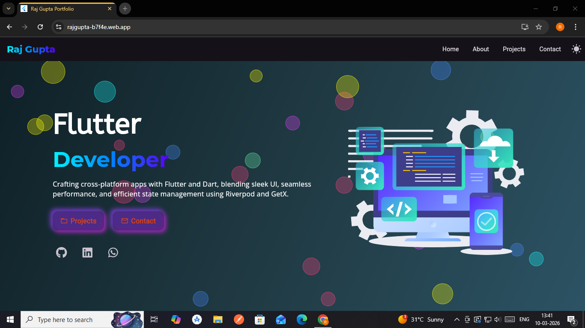
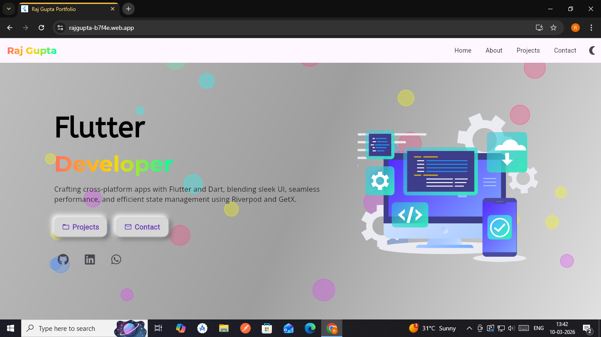
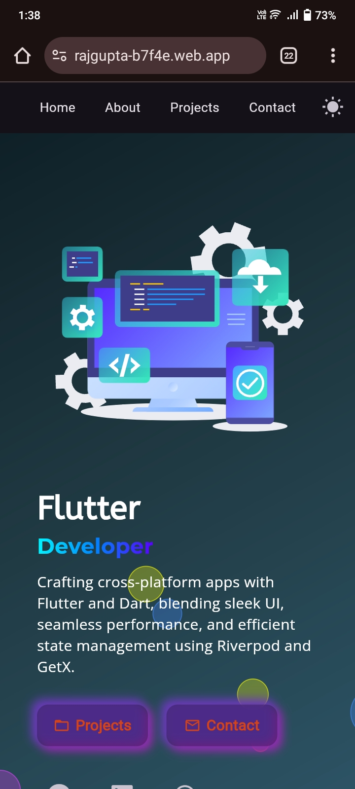
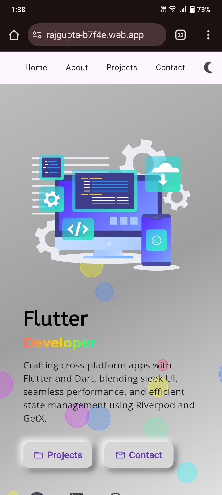

# Raj Gupta Portfolio

Welcome to my personal portfolio!  
This repository showcases my projects, skills, and work as a Flutter developer. Explore my **mobile and web applications** built using Flutter, with Firebase integrated for **comments functionality**.  

> **Note:** All design and development of this portfolio were done independently by me using Flutter and Firebase.

---

## 🌟 Features
- Cross-platform **mobile & web applications** built with Flutter  
- **Firebase** integration for comments  
- Interactive and **user-friendly portfolio**  
- Supports **Light & Dark Mode** on web  

---

## 🛠 Tech Stack
- **Flutter** – Cross-platform mobile & web apps  
- **Dart** – Programming language for Flutter  
- **Firebase** – Comments system  

---

## 💻 Desktop View

### Dark Mode

### Light Mode

---

## 📱 Mobile View

### Dark Mode

### Light Mode

---

## 🎥 Screen Recordings

### Desktop Demo
[▶ Watch Video](https://drive.google.com/file/d/1a52a_Qh0a3KJVLJFiZEp4813MWUvrbql/view?usp=drive_link)

### Mobile Demo
[▶ Watch Video](https://drive.google.com/file/d/1ZWfJNmP5nkHuaL4m9KKkkfpTpjGnaxoU/view?usp=sharing)
> *Note: Screen recordings show live interaction with my portfolio on desktop and mobile devices.*

---

## 🔗 Live Portfolio

🚀 **Visit My Portfolio:**  
🔗 https://rajgupta-b7f4e.web.app

---

## 📫 Contact Me
- **Email:** officialrajgupta12@gmail.com  
- **LinkedIn:** [My LinkedIn](https://www.linkedin.com/in/raj-gupta-b055a0296/)  
- **GitHub:** [My GitHub](https://github.com/rajgupta321)

---

> Built with ❤️ using Flutter & Firebase
